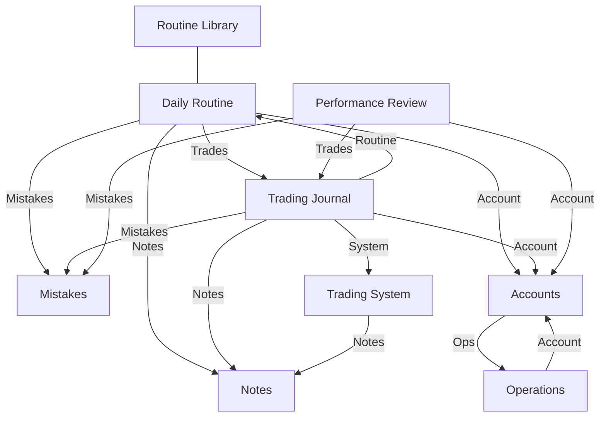

# Предметна модель пресетних даних (Preset Model)

Цей документ описує склад та структуру пресетних баз даних, які автоматично створюються при ініціалізації робочого простору.

## Перелік пресетних баз даних

| Ключ (Key)         | Назва (Title)      |
| :----------------- | :----------------- |
| trading-journal    | Trading Journal    |
| daily-routine      | Daily Routine      |
| routine-library    | Routine Library    |
| notes              | Notes              |
| mistakes           | Mistakes           |
| accounts           | Accounts           |
| operations         | Operations         |
| trading-system     | Trading System     |
| performance-review | Performance Review |

## Структура простору (Sections)

Робочий простір має бокову панель (Sidebar), в якій бази даних логічно згруповані у три основні секції.

| Секція       | Іконка / Колір           | Бази даних, що входять до неї                   | Призначення                                                                                               |
| :----------- | :----------------------- | :---------------------------------------------- | :-------------------------------------------------------------------------------------------------------- |
| **Routine**  | icon:CalendarDays (Blue) | Trading Journal, Daily Routine, Routine Library | Щоденна операційна діяльність, фіксація угод та аналіз сесій.                                             |
| **Insight**  | icon:Lightbulb (Yellow)  | Notes, Mistakes, Performance Review             | Бази знань для довгострокового навчання, виправлення помилок, збору інсайтів та періодичного самоаналізу. |
| **Settings** | icon:Settings (Purple)   | Accounts, Operations, Trading System            | Адміністративні бази, управління капіталом та правилами стратегій.                                        |

## Групи властивостей (Property Groups)

Властивості об'єднані у групи для зручності заповнення та відображення в UI.

- **General / Execution:** Базові метадані (назва, статус, дати, ціни).
- **Risk Management:** Все, що стосується грошей та ризику (SL, TP, P&L, комісії).
- **Context & Execution:** Аналітика ринку (таймфрейми, наратив, Origin/Target).
- **Psychology & Discipline:** Оцінка ментального стану та дотримання плану.
- **Advanced:** Професійні метрики (MFE, MAE, Efficiency, Hold Time).
- **Relations:** Зв'язки з іншими базами.
- **Prop Firm Specific:** Специфічні поля для проп-рахунків.

## Логічна структура зв'язків (Relations)

## Метадані та UX-атрибути властивостей

| Атрибут           | Опис                                                                                                                    |
| :---------------- | :---------------------------------------------------------------------------------------------------------------------- |
| **Hint**          | Детальне пояснення для користувача: навіщо потрібна ця властивість, що вона означає та як допомагає в аналізі торгівлі. |
| **Placeholder**   | Текст-приклад, що відображається у порожньому полі (напр. "EURUSD").                                                    |
| **Logic**         | Для FORMULA — математичний вираз; для інших — опис технічної поведінки.                                                 |
| **Default Value** | Значення, що автоматично підставляється у нові записи.                                                                  |

## Довідник системних списків (Select Options)

| Список                  | Варіанти значень                                                    |
| :---------------------- | :------------------------------------------------------------------ |
| **Timeframes**          | Monthly, Weekly, Daily, H4, H1, M15, M5, M1, Seconds                |
| **Sessions**            | Asia, London, NY AM, NY PM, London Close                            |
| **Directions**          | Long (Buy), Short (Sell)                                            |
| **Narrative Accuracy**  | Accurate, Partially Accurate, Wrong, Inconclusive                   |
| **Emotions**            | Calm, Anxious, FOMO, Greed, Fear, Revenge, Bored, Overconfident     |
| **Plan Adherence**      | Followed, Partial, Broken                                           |
| **Entry Models**        | Breakout, Retest, Reversal, Sweep+MSS, Silver Bullet, Turtle Soup   |
| **Market Regimes**      | Bullish Trend, Bearish Trend, Ranging/Chop, Volatile, Consolidation |
| **Mistake Categories**  | Preparation, Execution, Management, Exit, Psychology                |
| **Prop Firm Providers** | FTMO, Apex, Topstep, MyFundedFX, FundingPips, Goat Funded, The 5ers |
| **Drawdown Types**      | Static, Trailing, Relative                                          |
| **Currencies**          | USD, EUR, GBP, USDT, BTC, UAH                                       |

## Системні шаблони та Автоматизації (System Templates)

Кожна база даних постачається з набором шаблонів, які використовують **Name Patterns** (токени) та підтримують **Системні автоматизації** для зменшення ручної роботи.

| База даних             | Назва шаблону    | Name Pattern                     | Пов'язана автоматизація / Призначення                                         |
| :--------------------- | :--------------- | :------------------------------- | :---------------------------------------------------------------------------- |
| **Trading Journal**    | Intraday Trade   | Trade #{{count}}                 | **Авто-категоризація P&L**: встановлення статусу Win/Loss; розрахунок Risk %. |
|                        | Swing Trade      | Swing Trade #{{count}}           | **Авто-зв'язок з рутиною**: знаходить Daily Routine за датою створення.       |
| **Daily Routine**      | Daily Routine    | {{date}}                         | **Авто-зв'язок з угодами**: знаходить усі записи Trading Journal за цю дату.  |
| **Routine Library**    | Routine Library  | Routine Library #{{count}}       | Центральна база SOP (Standard Operating Procedures).                          |
| **Notes**              | Strategy Note    | Note #{{count}}                  | Шаблон для фіксації правил та нових патернів.                                 |
|                        | Observation      | Observation {{date}}             | Шаблон для вільних нотаток про поведінку ціни.                                |
| **Mistakes**           | Execution Error  | Error #{{count}}                 | Помилки технічного виконання.                                                 |
|                        | Plan Violation   | Violation #{{count}}             | **Автологування**: створюється автоматично при "Broken Plan" в угоді.         |
| **Accounts**           | Funded/Live      | Account #{{count}}               | Шаблон із налаштованими лімітами просадки та цілями.                          |
|                        | Personal/Demo    | Account #{{count}}               | Стандартний торговий рахунок.                                                 |
| **Operations**         | Deposit          | Deposit #{{count}}               | Стандартна операція поповнення рахунку.                                       |
|                        | Withdrawal       | Withdrawal #{{count}}            | Стандартна операція виводу коштів.                                            |
|                        | Prop Payout      | Prop Payout {{date}}             | Фіксація виплат та розподілу прибутку з проп-фірми.                           |
| **Trading System**     | Trading System   | Trading System #{{count}}        | **Авто-агрегація**: підрахунок Win Rate та Avg R на основі пов'язаних угод.   |
| **Performance Review** | Weekly Review    | Week {{W}} {{YYYY}}              | **Авто-збір**: знаходить усі угоди та помилки за поточний тиждень.            |
|                        | Monthly Review   | {{MMMM}} {{YYYY}}                | **Авто-збір**: агрегує статистику за минулий календарний місяць.              |
|                        | Quarterly Review | Quarterly Review Q{{Q}} {{YYYY}} | **Авто-збір**: підсумок за квартал.                                           |

## Специфікація властивостей баз даних

Нижче наведено перелік властивостей для кожної бази з відповідними конфігураційними параметрами.

### 1. Trading Journal (trading-journal)

**Шар А: Виконання (Execution)**
| # | Назва | Тип | Хінт | Конфіг (Config) | Приклад / Логіка |
| :--- | :--- | :--- | :--- | :--- | :--- |
| 0 | Name | TEXT | Короткий ідентифікатор угоди для швидкого пошуку в списку. | `isRequired: true` | "EU Long Breakout" |
| 1 | Status | SELECT | Відображає життєвий цикл угоди. | `isMultiSelect: false`, Options: `Active`, `Closed` | Active, Closed |
| 2 | Pair | SELECT | Конкретний актив. | `isMultiSelect: false`, categories: `PAIR_CATEGORIES` | "EURUSD" |
| 3 | Direction | SELECT | Напрямок позиції. | `isMultiSelect: false`, categories: `DIRECTION_OPTIONS` | Див. Directions |
| 4 | Entry Price | NUMBER | Точна ціна виконання ордера. | `defaultValue: 0, format: "float"` | "1.0850" |
| 5 | Exit Price | NUMBER | Середня ціна виходу. | `defaultValue: 0, format: "float"` | "1.0920" |
| 6 | Quantity | NUMBER | Об'єм позиції. | `defaultValue: 0, format: "float"` | "1.0 lot" |
| 7 | Entry Date | DATE | Час входу. | `format: "DD.MM.YYYY"` | - |
| 8 | Exit Date | DATE | Час виходу. | `format: "DD.MM.YYYY"` | - |

**Шар Б: Ризик-менеджмент**
| # | Назва | Тип | Хінт | Конфіг (Config) | Приклад / Логіка |
| :--- | :--- | :--- | :--- | :--- | :--- |
| 9 | Initial SL | NUMBER | Ціна, за якої ідея вважається невалідною. | `defaultValue: 0, format: "float"` | "1.0800" |
| 10 | Initial TP | NUMBER | Цільова ціна виходу. | `defaultValue: 0, format: "float"` | "1.1000" |
| 11 | Risk Amount ($) | FORMULA | Сума збитку при досягненні Stop Loss. | `{ output: { type: "text" } }` | (Entry - SL) _ Qty |
| 12 | Risk % | FORMULA | Відсоток від капіталу під загрозою. | `{ output: { type: "text" } }` | "1%" |
| 13 | Planned R | FORMULA | Потенційна винагорода відносно ризику. | `{ output: { type: "text" } }` | (TP-Entry)/(Entry-SL) |
| 14 | Actual R | FORMULA | Фактичне R-кратне в одиницях ризику. | `{ output: { type: "text" } }` | (Exit-Entry)/(Entry-SL) |
| 15 | Gross P&L | FORMULA | Результат угоди без урахування витрат. | `{ output: { type: "text" } }` | (Exit - Entry) _ Qty |
| 16 | Fees | NUMBER | Сумарні витрати на комісії та свопи. | `defaultValue: 0, format: "float"` | "5.00" |
| 17 | Net P&L | FORMULA | Реальний чистий прибуток. | `{ output: { type: "text" } }` | Gross P&L - Fees |

**Шар В: Контекст та Виконання (Context & Execution)**
| # | Назва | Тип | Хінт | Конфіг (Config) | Приклад / Логіка |
| :--- | :--- | :--- | :--- | :--- | :--- |
| 18 | Narrative Timeframe | SELECT | Основний аналітичний таймфрейм. | `isMultiSelect: false`, categories: `TIMEFRAME_OPTIONS` | Див. Timeframes |
| 19 | Execution Timeframe | SELECT | Таймфрейм точки входу. | `isMultiSelect: false`, categories: `TIMEFRAME_OPTIONS` | Див. Timeframes |
| 20 | Point A (Origin) | TEXT | Логічна точка старту цінового імпульсу. | - | "Asian Low Sweep" |
| 21 | Point B (Target) | TEXT | Ринкова ціль ціни. | - | "Daily FVG" |
| 22 | Entry Model | SELECT | Конкретний механічний сетап. | `isMultiSelect: false`, Options: Breakout, Retest, Reversal, Sweep+MSS, Silver Bullet, Turtle Soup | Sweep+MSS |
| 23 | Session / Time | SELECT | Торговий період. | `isMultiSelect: false`, categories: `SESSION_OPTIONS` | Див. Sessions |

**Шар Г: Психологія та Дисципліна**
| # | Назва | Тип | Хінт | Конфіг (Config) | Приклад / Логіка |
| :--- | :--- | :--- | :--- | :--- | :--- |
| 24 | Confidence | RATING | Ваша внутрішня впевненість у сетапі. | - | 1-5 зірок |
| 25 | Plan Adherence | SELECT | Наскільки точно ви виконали свій план. | `isMultiSelect: false`, Options: `Followed`, `Partial`, `Broken` | Followed |
| 26 | Emotion | SELECT | Емоційний фон під час торгівлі. | `isMultiSelect: true`, Options: Emotions list | FOMO, Revenge |

**Шар Ґ: Професійна аналітика (Advanced)**
| # | Назва | Тип | Хінт | Конфіг (Config) | Приклад / Логіка |
| :--- | :--- | :--- | :--- | :--- | :--- |
| 27 | MFE (Max Fav) | NUMBER | Максимальна ціна на користь угоди. | `defaultValue: 0, format: "float"` | "1.0950" |
| 28 | MAE (Max Adv) | NUMBER | Найгірша ціна проти угоди. | `defaultValue: 0, format: "float"` | "1.0820" |
| 29 | Exit Efficiency| FORMULA | Наскільки вчасно ви вийшли. | `{ output: { type: "text" } }` | % від MFE |
| 30 | Hold Time | FORMULA | Тривалість угоди. | `{ output: { type: "text" } }` | хв / год |

**Шар Д: Зв'язки (Relations)**
| # | Назва | Тип | Хінт | Конфіг (Config) | Приклад / Логіка |
| :--- | :--- | :--- | :--- | :--- | :--- |
| 31 | Trading System | RELATION | Прив'язка до конкретної стратегії. | `sourceDatabaseType: "trading-system", multiple: false` | (Single) |
| 32 | Account | RELATION | На якому рахунку відбувалася торгівля. | `sourceDatabaseType: "accounts", multiple: false` | (Single) |
| 33 | Daily Routine | RELATION | Контекст дня. | `sourceDatabaseType: "daily-routine", multiple: false` | (Single) |
| 34 | Notes | RELATION | Специфічні уроки або спостереження. | `sourceDatabaseType: "notes", multiple: true` | (Multiple) |
| 35 | Mistakes | RELATION | Допущені помилки. | `sourceDatabaseType: "mistakes", multiple: true` | (Multiple) |

---

### 2. Daily Routine (daily-routine)

| #   | Назва              | Тип      | Хінт                                         | Конфіг (Config)                                                               | Приклад / Логіка    |
| :-- | :----------------- | :------- | :------------------------------------------- | :---------------------------------------------------------------------------- | :------------------ |
| 0   | Name               | TEXT     | Назва торгової сесії або дня.                | `isRequired: true`                                                            | "London Open 22.05" |
| 1   | Date               | DATE     | Дата сесії.                                  | `format: "DD.MM.YYYY"`                                                        | -                   |
| 2   | Pair               | SELECT   | Головний актив дня.                          | `isMultiSelect: false`, categories: `PAIR_CATEGORIES`                         | "EURUSD"            |
| 3   | Narrative          | SELECT   | Ваш очікуваний напрямок ринку на основі HTF. | `isMultiSelect: false`, Options: `Bullish`, `Bearish`, `Neutral`, `Uncertain` | Bullish/Bearish     |
| 4   | Narrative Logic    | TEXT     | Детальне обґрунтування вашого біасу.         | -                                                                             | "Sweep of PDH..."   |
| 5   | Key Catalyst       | SELECT   | Новини або події.                            | `isMultiSelect: true`, Options: `CPI`, `NFP`, `FOMC`                          | CPI, NFP            |
| 6   | Narrative Outcome  | SELECT   | Фактичний напрямок, який показав ринок.      | `isMultiSelect: false`, Options: `Bullish`, `Bearish`, `Neutral`, `Uncertain` | Bullish/Bearish     |
| 7   | Narrative Accuracy | FORMULA  | Оцінка якості вашого аналізу.                | `{ output: { type: "text" } }`                                                | Авто-розрахунок     |
| 8   | Account            | RELATION | Основний рахунок сесії.                      | `sourceDatabaseType: "accounts", multiple: false`                             | (Single)            |
| 9   | Trades             | RELATION | Створені угоди.                              | `sourceDatabaseType: "trading-journal", multiple: true`                       | (Multiple)          |
| 10  | Notes              | RELATION | Спостереження в реальному часі.              | `sourceDatabaseType: "notes", multiple: true`                                 | (Multiple)          |
| 11  | Mistakes           | RELATION | Помилки за день.                             | `sourceDatabaseType: "mistakes", multiple: true`                              | (Multiple)          |

---

### 3. Routine Library (routine-library)

| #   | Назва             | Тип      | Хінт                                 | Конфіг (Config)                                       | Приклад / Логіка |
| :-- | :---------------- | :------- | :----------------------------------- | :---------------------------------------------------- | :--------------- |
| 0   | Name              | TEXT     | Назва чеклиста або SOP.              | `isRequired: true`                                    | "Morning SOP"    |
| 1   | Date              | DATE     | Дата останнього перегляду правил.    | `format: "DD.MM.YYYY"`                                | -                |
| 2   | Sleep Quality     | RATING   | Вплив сну на дисципліну.             | -                                                     | 1-5 зірок        |
| 3   | Pre-Market State  | SELECT   | Ваш ментальний стан перед торгівлею. | `isMultiSelect: true`, Options: Emotions list         | Calm, Anxious    |
| 4   | Post-Market State | SELECT   | Емоційний результат після сесії.     | `isMultiSelect: true`, Options: Emotions list         | Calm             |
| 5   | Plan Adherence    | RATING   | Загальна оцінка дисципліни за день.  | -                                                     | 1-5 зірок        |
| 6   | Distractions      | SELECT   | Фактори, що заважали концентрації.   | `isMultiSelect: true`, Options: `Phone`, `Social`     | "Phone"          |
| 7   | Daily Routines    | RELATION | Пов'язані сесії.                     | `sourceDatabaseType: "daily-routine", multiple: true` | (Multiple)       |

---

### 4. Notes (notes)

| #   | Назва           | Тип      | Хінт                                | Конфіг (Config)                                                                                     | Приклад / Логіка  |
| :-- | :-------------- | :------- | :---------------------------------- | :-------------------------------------------------------------------------------------------------- | :---------------- |
| 0   | Name            | TEXT     | Короткий заголовок інсайту.         | `isRequired: true`                                                                                  | "New S&R Pattern" |
| 1   | Date            | DATE     | Дата фіксації ідеї.                 | `format: "DD.MM.YYYY"`                                                                              | -                 |
| 2   | Category        | SELECT   | Групування за темами навчання.      | `isMultiSelect: true`, Options: Preparation, Execution, Management, Exit, Psychology                | Execution         |
| 3   | Confidence      | SELECT   | Рівень впевненості у патерні.       | `isMultiSelect: false`, Options: Backtested, Forwardtested, Live Observation, Guess                 | Backtested        |
| 4   | Source          | SELECT   | Джерело інсайту.                    | `isMultiSelect: true`, Options: Trade Loss, Trade Win, Book, Mentor, Backtest, Journal Review       | Trade Loss        |
| 5   | Market Regime   | SELECT   | Ринкові умови для патерна.          | `isMultiSelect: true`, Options: Bullish Trend, Bearish Trend, Ranging/Chop, Volatile, Consolidation | Bullish Trend     |
| 6   | Status          | SELECT   | Актуальність нотатки.               | `isMultiSelect: false`, Options: `Active`, `Archived`                                               | Active            |
| 7   | Last Used       | FORMULA  | Дата останнього посилання в угодах. | `{ output: { type: "text" } }`                                                                      | Авто-розрахунок   |
| 8   | Trading Journal | RELATION | Застосовані угоди.                  | `sourceDatabaseType: "trading-journal", multiple: true`                                             | (Multiple)        |
| 9   | Daily Routines  | RELATION | Пов'язані сесії появи.              | `sourceDatabaseType: "daily-routine", multiple: true`                                               | (Multiple)        |

---

### 5. Mistakes (mistakes)

| #   | Назва           | Тип      | Хінт                                | Конфіг (Config)                                                                      | Приклад / Логіка  |
| :-- | :-------------- | :------- | :---------------------------------- | :----------------------------------------------------------------------------------- | :---------------- |
| 0   | Name            | TEXT     | Чітка назва помилки.                | `isRequired: true`                                                                   | "Revenge Trading" |
| 1   | Date            | DATE     | Коли допущена вперше.               | `format: "DD.MM.YYYY"`                                                               | -                 |
| 2   | Category        | SELECT   | Де саме стався збій.                | `isMultiSelect: true`, Options: Preparation, Execution, Management, Exit, Psychology | Psychology        |
| 3   | Prevention Rule | TEXT     | Правило для уникнення.              | -                                                                                    | "Lock terminal"   |
| 4   | Status          | SELECT   | Вирішення проблеми.                 | `isMultiSelect: false`, Options: `Active`, `Resolved`                                | Active            |
| 5   | Resolved Date   | DATE     | Дата закриття проблеми.             | `format: "DD.MM.YYYY"`                                                               | -                 |
| 6   | Severity        | FORMULA  | Рівень небезпеки на основі частоти. | `{ output: { type: "text" } }`                                                       | Авто-розрахунок   |
| 7   | Total Cost      | FORMULA  | Сумарна шкода для балансу.          | `{ output: { type: "text" } }`                                                       | Сума P&L угод     |
| 8   | Last Used       | FORMULA  | Дата останнього повторення.         | `{ output: { type: "text" } }`                                                       | Авто-розрахунок   |
| 9   | Trading Journal | RELATION | Угоди, які постраждали.             | `sourceDatabaseType: "trading-journal", multiple: true`                              | (Multiple)        |
| 10  | Daily Routines  | RELATION | Дні, коли повторювалася.            | `sourceDatabaseType: "daily-routine", multiple: true`                                | (Multiple)        |

---

### 6. Accounts (accounts)

**Група: General Info**
| # | Назва | Тип | Хінт | Конфіг (Config) | Приклад / Логіка |
| :--- | :--- | :--- | :--- | :--- | :--- |
| 0 | Name | TEXT | Унікальне ім'я рахунку. | `isRequired: true` | "Funded 50k - Apex" |
| 1 | Account Type | SELECT | Правила та ризики для рахунку. | `isMultiSelect: false`, Options: `Prop Firm`, `Live`, `Demo` | Prop Firm |
| 2 | Account ID | TEXT | Технічний ідентифікатор рахунку. | - | "MT5-12345" |
| 3 | Currency | SELECT | Валюта розрахунків. | `isMultiSelect: false`, Options: `USD`, `EUR`, `GBP`, `USDT`, `BTC`, `UAH` | USD |
| 4 | Starting Balance | NUMBER | Початковий капітал. | `defaultValue: 0, format: "float"` | "50000" |
| 5 | Status | SELECT | Чи використовується зараз. | `isMultiSelect: false`, Options: `Active`, `Closed` | Active |
| 6 | Start Date | DATE | Дата відкриття рахунку. | `format: "DD.MM.YYYY"` | - |
| 7 | End Date | DATE | Дата закриття рахунку. | `format: "DD.MM.YYYY"` | - |

**Група: Risk & Compliance**
| # | Назва | Тип | Хінт | Конфіг (Config) | Приклад / Логіка |
| :--- | :--- | :--- | :--- | :--- | :--- |
| 8 | Max Overall Drawdown | NUMBER | Гранична втрата балансу. | `defaultValue: 0, format: "float"` | "5000" |
| 9 | Drawdown Type | SELECT | Механіка розрахунку просадки. | `isMultiSelect: false`, Options: `Static`, `Trailing`, `Relative` | Static |
| 10 | Daily Loss Limit | NUMBER | Системний ліміт збитків на добу. | `defaultValue: 0, format: "float"` | "1500" |
| 11 | Max Position Size | NUMBER | Максимальний об'єм позицій. | `defaultValue: 0, format: "float"` | "5 lots" |
| 12 | Max Open Trades | NUMBER | Максимальна кількість угод. | `defaultValue: 0, format: "integer"` | "3" |
| 13 | News Trading | SELECT | Дозвіл торгівлі на новинах. | `isMultiSelect: false`, Options: `Allowed`, `Restricted` | Allowed |
| 14 | Weekend Holding | SELECT | Дозвіл перенесення на вихідні. | `isMultiSelect: false`, Options: `Allowed`, `Forbidden` | Allowed |
| 15 | Hard Stop Loss | CHECKBOX | Обов'язковий фізичний стоп. | - | Yes/No |

**Група: Prop Firm Specific** (діє при Account Type = Prop Firm)
| # | Назва | Тип | Хінт | Конфіг (Config) | Приклад / Логіка |
| :--- | :--- | :--- | :--- | :--- | :--- |
| 16 | Provider | SELECT | Провайдер проп-рахунку. | `isMultiSelect: false`, Options: FTMO, Apex, Topstep, MyFundedFX, FundingPips, Goat Funded, The 5ers, `visibilityCondition: { dependsOnPropertyName: 'Account Type', operator: 'EQUALS', value: 'Prop Firm' }` | Apex |
| 17 | Phase | SELECT | Поточна фаза челенджу. | `isMultiSelect: false`, Options: Challenge, Verification, Funded, `visibilityCondition: { dependsOnPropertyName: 'Account Type', operator: 'EQUALS', value: 'Prop Firm' }` | Challenge |
| 18 | Profit Target | NUMBER | Ціль прибутку у відсотках. | `defaultValue: 0, format: "float"`, `visibilityCondition: { dependsOnPropertyName: 'Account Type', operator: 'EQUALS', value: 'Prop Firm' }` | "8" |
| 19 | Consistency Rule | NUMBER | Правило консистенції прибутку. | `defaultValue: 0, format: "float"`, `visibilityCondition: { dependsOnPropertyName: 'Account Type', operator: 'EQUALS', value: 'Prop Firm' }` | "30" |
| 20 | Min Trading Days | NUMBER | Мінімальна к-сть торгових днів. | `defaultValue: 0, format: "integer"`, `visibilityCondition: { dependsOnPropertyName: 'Account Type', operator: 'EQUALS', value: 'Prop Firm' }` | "5" |
| 21 | Profit Split | NUMBER | Розподіл прибутку (частка трейдера).| `defaultValue: 0, format: "float"`, `visibilityCondition: { dependsOnPropertyName: 'Account Type', operator: 'EQUALS', value: 'Prop Firm' }` | "90" |

**Зв'язки (Relations)**
| # | Назва | Тип | Хінт | Конфіг (Config) | Приклад / Логіка |
| :--- | :--- | :--- | :--- | :--- | :--- |
| 22 | Operations | RELATION | Всі фінансові транзакції рахунку. | `sourceDatabaseType: "operations", multiple: true` | (Multiple) |
| 23 | Trades | RELATION | Усі угоди на цьому рахунку. | `sourceDatabaseType: "trading-journal", multiple: true` | (Multiple) |

---

### 7. Operations (operations)

| #   | Назва   | Тип      | Хінт                  | Конфіг (Config)                                          | Приклад / Логіка |
| :-- | :------ | :------- | :-------------------- | :------------------------------------------------------- | :--------------- |
| 0   | Name    | TEXT     | Опис операції.        | `isRequired: true`                                       | "Withdrawal Jan" |
| 1   | Type    | SELECT   | Напрямок руху коштів. | `isMultiSelect: false`, Options: `Deposit`, `Withdrawal` | Deposit          |
| 2   | Date    | DATE     | Дата транзакції.      | `format: "DD.MM.YYYY"`                                   | -                |
| 3   | Account | RELATION | Зв'язаний рахунок.    | `sourceDatabaseType: "accounts", multiple: false`        | (Single)         |
| 4   | Amount  | NUMBER   | Сума операції.        | `defaultValue: 0, format: "float"`                       | "1000"           |

---

### 8. Trading System (trading-system)

| #   | Назва | Тип  | Хінт                        | Конфіг (Config)        | Приклад / Логіка |
| :-- | :---- | :--- | :-------------------------- | :--------------------- | :--------------- |
| 0   | Name  | TEXT | Назва торгової стратегії.   | `isRequired: true`     | "Silver Bullet"  |
| 1   | Date  | DATE | Дата створення або ревізії. | `format: "DD.MM.YYYY"` | -                |

---

### 9. Performance Review (performance-review)

| #   | Назва        | Тип      | Хінт                               | Конфіг (Config)                                          | Приклад / Логіка    |
| :-- | :----------- | :------- | :--------------------------------- | :------------------------------------------------------- | :------------------ |
| 0   | Name         | TEXT     | Заголовок огляду.                  | `isRequired: true`                                       | "Weekly Review W22" |
| 1   | Date         | DATE     | Дата проведення аналізу.           | `format: "DD.MM.YYYY"`                                   | -                   |
| 2   | Period       | SELECT   | Період аналізованого відрізку.     | `isMultiSelect: false`, Options: `Weekly`, `Monthly`     | Weekly              |
| 3   | Period Start | DATE     | Дата початку періоду.              | `format: "DD.MM.YYYY"`                                   | -                   |
| 4   | Period End   | DATE     | Дата закінчення періоду.           | `format: "DD.MM.YYYY"`                                   | -                   |
| 5   | Net P&L      | FORMULA  | Чистий заробіток за цей час.       | `{ output: { type: "text" } }`                           | Сума P&L періоду    |
| 6   | Trade Count  | FORMULA  | Кількість проведених угод.         | `{ output: { type: "text" } }`                           | Авто-розрахунок     |
| 7   | Win Rate     | FORMULA  | Частота успішних сетапів.          | `{ output: { type: "text" } }`                           | Авто-розрахунок     |
| 8   | Grade        | SELECT   | Суб'єктивна оцінка своєї роботи.   | `isMultiSelect: false`, Options: `A`, `B`, `C`, `D`, `F` | A                   |
| 9   | Account      | RELATION | Рахунок, для якого робиться огляд. | `sourceDatabaseType: "accounts", multiple: false`        | (Single)            |
| 10  | Trades       | RELATION | Угоди за період.                   | `sourceDatabaseType: "trading-journal", multiple: true`  | (Multiple)          |
| 11  | Mistakes     | RELATION | Головні помилки за період.         | `sourceDatabaseType: "mistakes", multiple: true`         | (Multiple)          |
