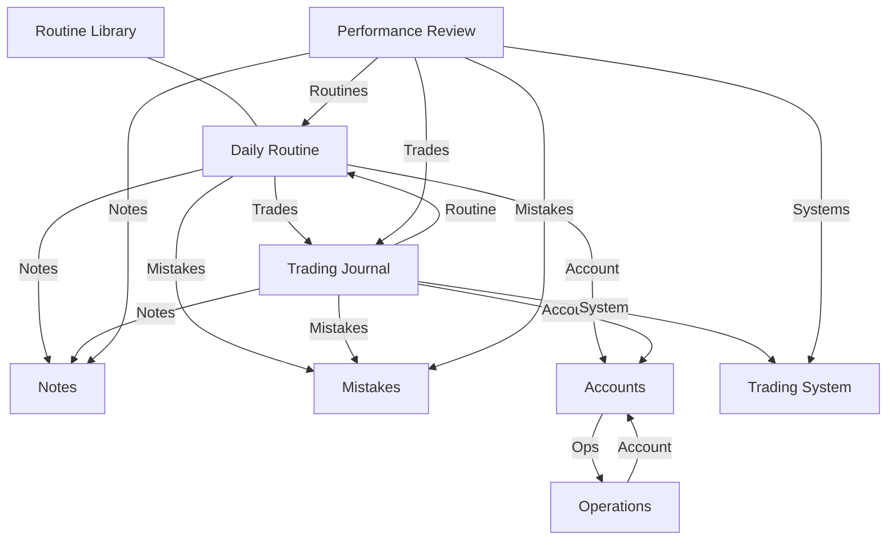

# Предметна модель пресетних даних (Preset Model)

Цей документ описує склад та структуру пресетних баз даних, які автоматично створюються при ініціалізації робочого простору.

## Перелік пресетних баз даних

| Ключ (Key)         | Назва (Title)      |
| :----------------- | :----------------- |
| trading-journal    | Trading Journal    |
| daily-routine      | Daily Routine      |
| routine-library    | Routine Library    |
| notes              | Notes              |
| mistakes           | Mistakes           |
| accounts           | Accounts           |
| operations         | Operations         |
| trading-system     | Trading System     |
| performance-review | Performance Review |

## Структура простору (Sections)

Робочий простір має бокову панель (Sidebar), в якій бази даних логічно згруповані у три основні секції.

| Секція       | Іконка / Колір           | Бази даних, що входять до неї                   | Призначення                                                                                               |
| :----------- | :----------------------- | :---------------------------------------------- | :-------------------------------------------------------------------------------------------------------- |
| **Routine**  | icon:CalendarDays (Blue) | Trading Journal, Daily Routine, Routine Library | Щоденна операційна діяльність, фіксація угод та аналіз сесій.                                             |
| **Insight**  | icon:Lightbulb (Yellow)  | Notes, Mistakes, Performance Review             | Бази знань для довгострокового навчання, виправлення помилок, збору інсайтів та періодичного самоаналізу. |
| **Settings** | icon:Settings (Purple)   | Accounts, Operations, Trading System            | Адміністративні бази, управління капіталом та правилами стратегій.                                        |

## Групи властивостей (Property Groups)

Властивості об'єднані у групи для зручності заповнення та відображення в UI.

- **General / Execution:** Базові метадані (назва, статус, дати, ціни).
- **Risk Management:** Все, що стосується грошей та ризику (SL, TP, P&L, комісії).
- **Context & Execution:** Аналітика ринку (таймфрейми, наратив, Origin/Target).
- **Psychology & Discipline:** Оцінка ментального стану та дотримання плану.
- **Advanced:** Професійні метрики (MFE, MAE, Efficiency, Hold Time).
- **Relations:** Зв'язки з іншими базами.
- **Prop Firm Specific:** Специфічні поля для проп-рахунків.

## Логічна структура зв'язків (Relations)

## Метадані та UX-атрибути властивостей

| Атрибут           | Опис                                                                                                                    |
| :---------------- | :---------------------------------------------------------------------------------------------------------------------- |
| **Hint**          | Детальне пояснення для користувача: навіщо потрібна ця властивість, що вона означає та як допомагає в аналізі торгівлі. |
| **Placeholder**   | Текст-приклад, що відображається у порожньому полі (напр. "EURUSD").                                                    |
| **Logic**         | Для FORMULA — математичний вираз; для інших — опис технічної поведінки.                                                 |
| **Default Value** | Значення, що автоматично підставляється у нові записи.                                                                  |

## Довідник системних списків (Select Options)

| Список                  | Варіанти значень                                                    |
| :---------------------- | :------------------------------------------------------------------ |
| **Timeframes**          | Monthly, Weekly, Daily, H4, H1, M15, M5, M1, Seconds                |
| **Sessions**            | Asia, London, NY AM, NY PM, London Close                            |
| **Directions**          | Long (Buy), Short (Sell)                                            |
| **Narrative Accuracy**  | Accurate, Partially Accurate, Wrong, Inconclusive                   |
| **Emotions**            | Calm, Anxious, FOMO, Greed, Fear, Revenge, Bored, Overconfident     |
| **Plan Adherence**      | Followed, Partial, Broken                                           |
| **Entry Models**        | Breakout, Retest, Reversal, Sweep+MSS, Silver Bullet, Turtle Soup   |
| **Market Regimes**      | Bullish Trend, Bearish Trend, Ranging/Chop, Volatile, Consolidation |
| **Mistake Categories**  | Preparation, Execution, Management, Exit, Psychology                |
| **Prop Firm Providers** | FTMO, Apex, Topstep, MyFundedFX, FundingPips, Goat Funded, The 5ers |
| **Drawdown Types**      | Static, Trailing, Relative                                          |
| **Currencies**          | USD, EUR, GBP, USDT, BTC, UAH                                       |

## Системні шаблони та Автоматизації (System Templates)

Кожна база даних постачається з набором шаблонів, які використовують **Name Patterns** (токени) та підтримують **Системні автоматизації** для зменшення ручної роботи.

| База даних             | Назва шаблону    | Name Pattern                     | Пов'язана автоматизація / Призначення                                         |
| :--------------------- | :--------------- | :------------------------------- | :---------------------------------------------------------------------------- |
| **Trading Journal**    | Intraday Trade   | Trade #{{count}}                 | **Авто-категоризація P&L**: встановлення статусу Win/Loss; розрахунок Risk %. |
|                        | Swing Trade      | Swing Trade #{{count}}           | **Авто-зв'язок з рутиною**: знаходить Daily Routine за датою створення.       |
| **Daily Routine**      | Daily Routine    | {{date}}                         | **Авто-зв'язок з угодами**: знаходить усі записи Trading Journal за цю дату.  |
| **Routine Library**    | Routine Library  | Routine Library {{today}}        | Central SOP (Standard Operating Procedures) database templates.               |
| **Notes**              | Strategy Note    | Note #{{count}}                  | Шаблон для фіксації правил та нових патернів.                                 |
|                        | Observation      | Observation {{date}}             | Шаблон для вільних нотаток про поведінку ціни.                                |
| **Mistakes**           | Execution Error  | Error #{{count}}                 | Помилки технічного виконання.                                                 |
|                        | Plan Violation   | Violation #{{count}}             | **Автологування**: створюється автоматично при "Broken Plan" в угоді.         |
| **Accounts**           | Funded/Live      | Account #{{count}}               | Шаблон із налаштованими лімітами просадки та цілями.                          |
|                        | Personal/Demo    | Account #{{count}}               | Стандартний торговий рахунок.                                                 |
| **Operations**         | Deposit          | Deposit #{{count}}               | Стандартна операція поповнення рахунку.                                       |
|                        | Withdrawal       | Withdrawal #{{count}}            | Стандартна операція виводу коштів.                                            |
|                        | Prop Payout      | Prop Payout {{date}}             | Фіксація виплат та розподілу прибутку з проп-фірми.                           |
| **Trading System**     | Trading System   | Trading System #{{count}}        | **Авто-агрегація**: підрахунок Win Rate та Avg R на основі пов'язаних угод.   |
| **Performance Review** | Weekly Review    | Week {{W}} {{YYYY}}              | **Авто-збір**: знаходить усі угоди та помилки за поточний тиждень.            |
|                        | Monthly Review   | {{MMMM}} {{YYYY}}                | **Авто-збір**: агрегує статистику за минулий календарний місяць.              |
|                        | Quarterly Review | Quarterly Review Q{{Q}} {{YYYY}} | **Авто-збір**: підсумок за квартал.                                           |

## Специфікація властивостей баз даних

### 1. Trading Journal (trading-journal)

**Шар А: Виконання (Execution)**
| # | Назва | Тип | Хінт | Конфіг (Config) | Приклад / Логіка |
| :--- | :--- | :--- | :--- | :--- | :--- |
| 0 | Name | TEXT | Короткий ідентифікатор угоди для швидкого пошуку в списку. | `isRequired: true` | "EU Long Breakout" |
| 1 | Status | SELECT | Відображає життєвий цикл угоди. | `isMultiSelect: false`, Options: `Active`, `Closed` | Active, Closed |
| 2 | Pair | SELECT | Конкретний актив. | `isMultiSelect: false`, categories: `PAIR_CATEGORIES` | "EURUSD" |
| 3 | Direction | SELECT | Напрямок позиції. | `isMultiSelect: false`, Options: `Long`, `Short` | Long, Short |
| 4 | Entry Price | NUMBER | Точна ціна виконання ордера. | `defaultValue: 0, format: "float"` | "1.0850" |
| 5 | Exit Price | NUMBER | Середня ціна виходу. | `defaultValue: 0, format: "float"` | "1.0920" |
| 6 | Quantity | NUMBER | Об'єм позиції. | `defaultValue: 0, format: "float"` | "1.0 lot" |
| 7 | Entry Date | DATE | Час входу. | `format: "DD.MM.YYYY HH:mm"` | - |
| 8 | Exit Date | DATE | Час виходу. | `format: "DD.MM.YYYY HH:mm"` | - |
| 9 | Outcome | SELECT | Фінальний результат угоди. | `isMultiSelect: false`, Options: `Win`, `Loss`, `Breakeven` | Win, Loss, Breakeven |

**Шар Б: Ризик-менеджмент**
| # | Назва | Тип | Хінт | Конфіг (Config) | Приклад / Логіка |
| :--- | :--- | :--- | :--- | :--- | :--- |
| 10 | Initial SL | NUMBER | Ціна, за якої ідея вважається невалідною. | `defaultValue: 0, format: "float"` | "1.0800" |
| 11 | Initial TP | NUMBER | Цільова ціна виходу. | `defaultValue: 0, format: "float"` | "1.1000" |
| 12 | Risk Amount ($) | FORMULA | Сума збитку при досягненні Stop Loss. | `expression: "IF({{Initial SL}} == 0, 0, ABS({{Entry Price}} - {{Initial SL}}) * {{Quantity}})", resultType: "NUMBER"` | (Entry - SL) * Qty |
| 13 | Risk % | FORMULA | Відсоток від капіталу під загрозою. | `expression: "({{Risk Amount ($)}} / 100000) _ 100", resultType: "NUMBER"`| "1%" |
| 14 | Planned R | FORMULA | Потенційна винагорода відносно ризику. |`expression: "IF({{Direction}} == 'Long', ...)", resultType: "NUMBER"`| (TP-Entry)/(Entry-SL) |
| 15 | Actual R | FORMULA | Фактичне R-кратне в одиницях ризику. |`expression: "IF({{Direction}} == 'Long', ...)", resultType: "NUMBER"`| (Exit-Entry)/(Entry-SL) |
| 16 | Gross P&L | FORMULA | Результат угоди без урахування витрат. |`expression: "IF({{Direction}} == 'Long', ...)", resultType: "NUMBER"` | (Exit - Entry) _ Qty |
| 17 | Fees | NUMBER | Сумарні витрати на комісії та свопи. | `defaultValue: 0, format: "float"` | "5.00" |
| 18 | Net P&L | FORMULA | Реальний чистий прибуток. | `expression: "{{Gross P&L}} - {{Fees}}", resultType: "NUMBER"` | Gross P&L - Fees |

**Шар В: Контекст та Виконання (Context & Execution)**
| # | Назва | Тип | Хінт | Конфіг (Config) | Приклад / Логіка |
| :--- | :--- | :--- | :--- | :--- | :--- |
| 19 | Narrative Timeframe | SELECT | Основний аналітичний таймфрейм. | `isMultiSelect: false`, Options: TIMEFRAME_OPTIONS | Див. Timeframes |
| 20 | Execution Timeframe | SELECT | Таймфрейм точки входу. | `isMultiSelect: false`, Options: TIMEFRAME_OPTIONS | Див. Timeframes |
| 21 | Point A (Origin) | TEXT | Логічна точка старту цінового імпульсу. | - | "Asian Low Sweep" |
| 22 | Point B (Target) | TEXT | Ринкова ціль ціни. | - | "Daily FVG" |
| 23 | Entry Model | SELECT | Конкретний механічний сетап. | `isMultiSelect: false`, Options: Breakout, Retest, Reversal, Sweep+MSS, Silver Bullet, Turtle Soup | Sweep+MSS |
| 24 | Session / Time | SELECT | Торговий період. | `isMultiSelect: false`, Options: SESSION_OPTIONS | Див. Sessions |

**Шар Г: Психологія та Дисципліна**
| # | Назва | Тип | Хінт | Конфіг (Config) | Приклад / Логіка |
| :--- | :--- | :--- | :--- | :--- | :--- |
| 25 | Confidence | RATING | Ваша внутрішня впевненість у сетапі. | - | 1-5 зірок |
| 26 | Setup Quality | RATING | Об'єктивна якість сетапу по чеклисту. | `maxStars: 5, allowHalf: true` | 1-5 зірок |
| 27 | Plan Adherence | SELECT | Наскільки точно ви виконали свій план. | `isMultiSelect: false`, Options: `Followed`, `Partial`, `Broken` | Followed |
| 28 | Emotion | SELECT | Емоційний фон під час торгівлі. | `isMultiSelect: true`, Options: Emotions list | FOMO, Revenge |

**Шар Ґ: Професійна аналітика (Advanced)**
| # | Назва | Тип | Хінт | Конфіг (Config) | Приклад / Логіка |
| :--- | :--- | :--- | :--- | :--- | :--- |
| 29 | MFE (Max Fav) | NUMBER | Максимальна ціна на користь угоди. | `defaultValue: 0, format: "float"` | "1.0950" |
| 30 | MAE (Max Adv) | NUMBER | Найгірша ціна проти угоди. | `defaultValue: 0, format: "float"` | "1.0820" |
| 31 | Exit Efficiency| FORMULA | Наскільки вчасно ви вийшли. | `expression: "IF(...)", resultType: "PROGRESS"` | % від MFE |
| 32 | Hold Time | FORMULA | Тривалість угоди. | `expression: "IF(IS_EMPTY({{Exit Date}}), 0, DATE_DIFF(...))", resultType: "DURATION"` | хв / год |

**Шар Д: Зв'язки (Relations)**
| # | Назва | Тип | Хінт | Конфіг (Config) | Приклад / Логіка |
| :--- | :--- | :--- | :--- | :--- | :--- |
| 33 | Trading System | RELATION | Прив'язка до конкретної стратегії. | `sourceDatabaseType: "trading-system", multiple: false` | (Single) |
| 34 | Account | RELATION | На якому рахунку відбувалася торгівля. | `sourceDatabaseType: "accounts", multiple: false` | (Single) |
| 35 | Daily Routine | RELATION | Контекст дня. | `sourceDatabaseType: "daily-routine", multiple: false` | (Single) |
| 36 | Notes | RELATION | Специфічні уроки або спостереження. | `sourceDatabaseType: "notes", multiple: true` | (Multiple) |
| 37 | Mistakes | RELATION | Допущені помилки. | `sourceDatabaseType: "mistakes", multiple: true` | (Multiple) |
| 38 | Is Win | FORMULA | Допоміжний прапорець перемоги. | `expression: "IF({{Outcome}} == 'Win', 1, 0)", resultType: "NUMBER"` | 1 / 0 |

---

### 2. Daily Routine (daily-routine)

**Група: General**
| # | Назва | Тип | Хінт | Конфіг (Config) | Приклад / Логіка |
| :--- | :--- | :--- | :--- | :--- | :--- |
| 0 | Name | TEXT | Назва торгової сесії або дня. | `isRequired: true` | "London Open 22.05" |
| 1 | Date | DATE | Дата сесії. | `format: "DD.MM.YYYY"` | - |
| 2 | Pair | SELECT | Головний актив дня. | `isMultiSelect: false`, categories: `PAIR_CATEGORIES` | "EURUSD" |

**Група: Analysis**
| # | Назва | Тип | Хінт | Конфіг (Config) | Приклад / Логіка |
| :--- | :--- | :--- | :--- | :--- | :--- |
| 3 | Narrative | SELECT | Ваш очікуваний напрямок ринку на основі HTF. | `isMultiSelect: false`, Options: `Bullish`, `Bearish`, `Neutral`, `Uncertain` | Bullish/Bearish |
| 4 | Narrative Logic | TEXT | Детальне обґрунтування вашого біасу. | - | "Sweep of PDH..." |
| 5 | Key Catalyst | SELECT | Новини або події. | `isMultiSelect: true`, Options: CPI, NFP, FOMC, etc. | CPI, NFP |
| 6 | Narrative Outcome | SELECT | Фактичний напрямок, який показав ринок. | `isMultiSelect: false`, Options: `Bullish`, `Bearish`, `Neutral`, `Uncertain` | Bullish/Bearish |
| 7 | Narrative Accuracy | FORMULA | Оцінка якості вашого аналізу. | `expression: "IF({{Narrative}} == {{Narrative Outcome}}, 'Correct', 'Incorrect')", resultType: "TEXT"` | Correct / Incorrect |
| 8 | Key Levels | TEXT | Ключові рівні/зони під час пре-маркету. | - | "H4 FVG, Daily OB" |

**Група: Stats**
| # | Назва | Тип | Хінт | Конфіг (Config) | Приклад / Логіка |
| :--- | :--- | :--- | :--- | :--- | :--- |
| 9 | Session P&L | FORMULA | Сумарний Net P&L угод за сесію. | `expression: "SUM(MAP({{Trades}}, 'Net P&L'))", resultType: "NUMBER"` | Авто-розрахунок |
| 10 | Trade Count | FORMULA | Кількість угод за сесію. | `expression: "COUNT({{Trades}})", resultType: "NUMBER"` | Авто-розрахунок |

**Група: Relations**
| # | Назва | Тип | Хінт | Конфіг (Config) | Приклад / Логіка |
| :--- | :--- | :--- | :--- | :--- | :--- |
| 11 | Account | RELATION | Основний рахунок сесії. | `sourceDatabaseType: "accounts", multiple: false` | (Single) |
| 12 | Trades | RELATION | Створені угоди. | `sourceDatabaseType: "trading-journal", multiple: true` | (Multiple) |
| 13 | Notes | RELATION | Спостереження в реальному часі. | `sourceDatabaseType: "notes", multiple: true` | (Multiple) |
| 14 | Mistakes | RELATION | Помилки за день. | `sourceDatabaseType: "mistakes", multiple: true` | (Multiple) |

---

### 3. Routine Library (routine-library)

**Група: General**
| # | Назва | Тип | Хінт | Конфіг (Config) | Приклад / Логіка |
| :--- | :--- | :--- | :--- | :--- | :--- |
| 0 | Name | TEXT | Назва чеклиста або SOP. | - | "Morning SOP" |
| 1 | Date | DATE | Дата останнього перегляду правил. | `format: "DD.MM.YYYY"` | - |

**Група: Metrics**
| # | Назва | Тип | Хінт | Конфіг (Config) | Приклад / Логіка |
| :--- | :--- | :--- | :--- | :--- | :--- |
| 2 | Sleep Quality | RATING | Вплив сну на дисципліну. | `maxStars: 5, allowHalf: true` | 1-5 зірок |

**Група: Psychology**
| # | Назва | Тип | Хінт | Конфіг (Config) | Приклад / Логіка |
| :--- | :--- | :--- | :--- | :--- | :--- |
| 3 | Pre-Market State | SELECT | Ваш ментальний стан перед торгівлею. | `isMultiSelect: true`, Options: Emotions list | Calm, Anxious |
| 4 | Post-Market State | SELECT | Емоційний результат після сесії. | `isMultiSelect: true`, Options: Emotions list | Calm |
| 5 | Plan Adherence | RATING | Загальна оцінка дисципліни за день. | `maxStars: 5, allowHalf: true` | 1-5 зірок |
| 6 | Distractions | SELECT | Фактори, що заважали концентрації. | `isMultiSelect: true`, Options: `Phone`, `Social` | "Phone" |

**Група: Relations**
| # | Назва | Тип | Хінт | Конфіг (Config) | Приклад / Логіка |
| :--- | :--- | :--- | :--- | :--- | :--- |
| 7 | Daily Routines | RELATION | Пов'язані сесії. | `sourceDatabaseType: "daily-routine", multiple: true` | (Multiple) |

---

### 4. Notes (notes)

**Група: General**
| # | Назва | Тип | Хінт | Конфіг (Config) | Приклад / Логіка |
| :--- | :--- | :--- | :--- | :--- | :--- |
| 0 | Name | TEXT | Короткий заголовок інсайту. | `isRequired: true` | "New S&R Pattern" |
| 1 | Date | DATE | Дата фіксації ідеї. | `format: "DD.MM.YYYY"` | - |
| 2 | Category | SELECT | Групування за темами навчання. | `isMultiSelect: true`, Options: Strategy, Analysis, Execution, Risk Management, Rules, Psychology | Execution |
| 3 | Status | SELECT | Актуальність нотатки. | `isMultiSelect: false`, Options: `Draft`, `Active`, `Archived` | Active |
| 4 | Confidence | SELECT | Рівень впевненості у патерні. | `isMultiSelect: false`, Options: Backtested, Forwardtested, Live Observation, Guess | Backtested |
| 5 | Source | SELECT | Джерело інсайту. | `isMultiSelect: true`, Options: Trade Loss, Trade Win, Book, Video, Course, Mentor, Research, etc. | Trade Loss |
| 6 | Market Regime | SELECT | Ринкові умови для патерна. | `isMultiSelect: true`, Options: Bullish Trend, Bearish Trend, Ranging/Chop, Volatile, Consolidation | Bullish Trend |
| 7 | Rating | RATING | Важливість інсайту. | `maxStars: 5, allowHalf: true` | 1-5 зірок |
| 9 | Times Applied | FORMULA | Кількість використань в угодах. | `expression: "COUNT({{Trading Journal}})", resultType: "NUMBER"` | Авто-розрахунок |
| 10 | Last Used | FORMULA | Дата останнього посилання в угодах. | `expression: "MAX(MAP({{Trading Journal}}, 'Entry Date'))", resultType: "DATE"` | Авто-розрахунок |

**Група: Context**
| # | Назва | Тип | Хінт | Конфіг (Config) | Приклад / Логіка |
| :--- | :--- | :--- | :--- | :--- | :--- |
| 8 | Pair | SELECT | Інструмент(и), до яких застосовується інсайт. | `isMultiSelect: true`, categories: PAIR_CATEGORIES | "EURUSD" |

**Група: Relations**
| # | Назва | Тип | Хінт | Конфіг (Config) | Приклад / Логіка |
| :--- | :--- | :--- | :--- | :--- | :--- |
| 11 | Trading Journal | RELATION | Застосовані угоди. | `sourceDatabaseType: "trading-journal", multiple: true` | (Multiple) |
| 12 | Mistakes | RELATION | Пов'язані помилки. | `sourceDatabaseType: "mistakes", multiple: true` | (Multiple) |
| 13 | Learning Tasks | RELATION | Навчальні завдання (плани). | `sourceDatabaseType: "learning-tasks", multiple: true` | (Multiple) |
| 14 | Daily Routines | RELATION | Пов'язані сесії появи. | `sourceDatabaseType: "daily-routine", multiple: true` | (Multiple) |

---

### 5. Mistakes (mistakes)

**Група: General**
| # | Назва | Тип | Хінт | Конфіг (Config) | Приклад / Логіка |
| :--- | :--- | :--- | :--- | :--- | :--- |
| 0 | Name | TEXT | Чітка назва помилки. | `isRequired: true` | "Revenge Trading" |
| 1 | Date | DATE | Коли допущена вперше. | `format: "DD.MM.YYYY"` | - |
| 2 | Category | SELECT | Де саме стався збій. | `isMultiSelect: true`, Options: Preparation, Analysis, Execution, Management, Exit, Psychology | Psychology |
| 3 | Trigger | SELECT | Що спровокувало помилку. | `isMultiSelect: true`, Options: Losing Streak, Winning Streak, FOMO, Overconfidence, Boredom, News Event, etc. | FOMO |
| 4 | Impact Type | SELECT | Тип збитку. | `isMultiSelect: false`, Options: Financial Loss, Missed Opportunity, Rule Violation, Psychological | Financial Loss |
| 5 | Prevention Rule | TEXT | Правило для уникнення. | - | "Lock terminal" |
| 6 | Status | SELECT | Вирішення проблеми. | `isMultiSelect: false`, Options: `Active`, `Monitoring`, `Resolved` | Active |
| 7 | Resolved Date | DATE | Дата закриття проблеми. | `format: "DD.MM.YYYY"` | - |

**Група: Stats**
| # | Назва | Тип | Хінт | Конфіг (Config) | Приклад / Логіка |
| :--- | :--- | :--- | :--- | :--- | :--- |
| 8 | Severity | FORMULA | Рівень небезпеки на основі частоти. | `expression: "IF(COUNT({{Trading Journal}}) + COUNT({{Daily Routines}}) > 5, 'High', ...)", resultType: "TEXT"` | High / Medium / Low |
| 9 | Recurrence Count | FORMULA | Кількість рецидивів. | `expression: "COUNT({{Trading Journal}}) + COUNT({{Daily Routines}})", resultType: "NUMBER"` | Авто-розрахунок |
| 10 | Total Cost | FORMULA | Сумарна шкода для балансу. | `expression: "ABS(SUM(MAP({{Trading Journal}}, 'Net P&L')))", resultType: "NUMBER"` | Сума P&L угод |
| 11 | Last Used | FORMULA | Дата останнього повторення. | `expression: "MAX(MAP({{Trading Journal}}, 'Entry Date'))", resultType: "DATE"` | Авто-розрахунок |

**Група: Relations**
| # | Назва | Тип | Хінт | Конфіг (Config) | Приклад / Логіка |
| :--- | :--- | :--- | :--- | :--- | :--- |
| 12 | Trading Journal | RELATION | Угоди, які постраждали. | `sourceDatabaseType: "trading-journal", multiple: true` | (Multiple) |
| 13 | Daily Routines | RELATION | Дні, коли повторювалася. | `sourceDatabaseType: "daily-routine", multiple: true` | (Multiple) |

---

### 6. Accounts (accounts)

**Група: General Info**
| # | Назва | Тип | Хінт | Конфіг (Config) | Приклад / Логіка |
| :--- | :--- | :--- | :--- | :--- | :--- |
| 0 | Name | TEXT | Унікальне ім'я рахунку. | `isRequired: true` | "Funded 50k - Apex" |
| 1 | Account Type | SELECT | Правила та ризики для рахунку. | `isMultiSelect: false`, Options: `Prop Firm`, `Live`, `Demo` | Prop Firm |
| 2 | Account ID | TEXT | Технічний ідентифікатор рахунку. | - | "MT5-12345" |
| 3 | Currency | SELECT | Валюта розрахунків. | `isMultiSelect: false`, Options: USD, EUR, GBP, USDT, BTC, UAH | USD |
| 4 | Starting Balance | NUMBER | Початковий капітал. | `defaultValue: 0, format: "float"` | "50000" |
| 5 | Status | SELECT | Чи використовується зараз. | `isMultiSelect: false`, Options: `Active`, `Paused`, `Closed`, `Failed` | Active |
| 6 | Start Date | DATE | Дата відкриття рахунку. | `format: "DD.MM.YYYY"` | - |
| 7 | End Date | DATE | Дата закриття рахунку. | `format: "DD.MM.YYYY"` | - |

**Група: Risk & Compliance**
| # | Назва | Тип | Хінт | Конфіг (Config) | Приклад / Логіка |
| :--- | :--- | :--- | :--- | :--- | :--- |
| 8 | Max Overall Drawdown | NUMBER | Гранична втрата балансу. | `defaultValue: 0, format: "float"` | "5000" |
| 9 | Drawdown Type | SELECT | Механіка розрахунку просадки. | `isMultiSelect: false`, Options: `Static`, `Trailing`, `Relative`, `visibilityCondition: { dependsOnPropertyName: 'Account Type', operator: 'EQUALS', value: 'Prop Firm' }` | Static |
| 10 | Daily Loss Limit | NUMBER | Системний ліміт збитків на добу. | `defaultValue: 0, format: "float"` | "1500" |
| 11 | Max Position Size | NUMBER | Максимальний об'єм позицій. | `defaultValue: 0, format: "float"` | "5 lots" |
| 12 | Max Open Trades | NUMBER | Максимальна кількість угод. | `defaultValue: 0, format: "integer"` | "3" |
| 13 | News Trading | SELECT | Дозвіл торгівлі на новинах. | `isMultiSelect: false`, Options: `Allowed`, `Restricted` | Allowed |
| 14 | Weekend Holding | SELECT | Дозвіл перенесення на вихідні. | `isMultiSelect: false`, Options: `Allowed`, `Forbidden` | Allowed |

**Група: Prop Firm Specific** (діє при Account Type = Prop Firm)
| # | Назва | Тип | Хінт | Конфіг (Config) | Приклад / Логіка |
| :--- | :--- | :--- | :--- | :--- | :--- |
| 16 | Provider | SELECT | Провайдер проп-рахунку. | `isMultiSelect: false`, Options: FTMO, Apex, Topstep, MyFundedFX, FundingPips, Goat Funded, The 5ers, `visibilityCondition: { dependsOnPropertyName: 'Account Type', operator: 'EQUALS', value: 'Prop Firm' }` | Apex |
| 17 | Phase | SELECT | Поточна фаза челенджу. | `isMultiSelect: false`, Options: Challenge, Verification, Funded, `visibilityCondition: { dependsOnPropertyName: 'Account Type', operator: 'EQUALS', value: 'Prop Firm' }` | Challenge |
| 18 | Profit Target | NUMBER | Ціль прибутку у відсотках. | `defaultValue: 0, format: "float"`, `visibilityCondition: { dependsOnPropertyName: 'Account Type', operator: 'EQUALS', value: 'Prop Firm' }` | "8" |
| 19 | Consistency Rule | NUMBER | Правило консистенції прибутку. | `defaultValue: 0, format: "float"`, `visibilityCondition: { dependsOnPropertyName: 'Account Type', operator: 'EQUALS', value: 'Prop Firm' }` | "30" |
| 20 | Min Trading Days | NUMBER | Мінімальна к-сть торгових днів. | `defaultValue: 0, format: "integer"`, `visibilityCondition: { dependsOnPropertyName: 'Account Type', operator: 'EQUALS', value: 'Prop Firm' }` | "5" |
| 21 | Profit Split | NUMBER | Розподіл прибутку (частка трейдера).| `defaultValue: 0, format: "float"`, `visibilityCondition: { dependsOnPropertyName: 'Account Type', operator: 'EQUALS', value: 'Prop Firm' }` | "90" |
| 22 | Challenge Fee | NUMBER | Вартість проходження. | `defaultValue: 0, format: "currency", currencySymbol: "$", decimalPlaces: 2`, `visibilityCondition: { dependsOnPropertyName: 'Account Type', operator: 'EQUALS', value: 'Prop Firm' }` | "$500" |

**Група: Live / Demo** (діє при Account Type = Live або Demo)
| # | Назва | Тип | Хінт | Конфіг (Config) | Приклад / Логіка |
| :--- | :--- | :--- | :--- | :--- | :--- |
| 23 | Broker | TEXT | Назва брокера. | `visibilityCondition: { dependsOnPropertyName: 'Account Type', operator: 'IN', value: ['Live', 'Demo'] }` | "IC Markets" |
| 24 | Platform | SELECT | Торгова платформа. | `isMultiSelect: false`, Options: MT4, MT5, cTrader, TradingView, NinjaTrader, Other, `visibilityCondition: { dependsOnPropertyName: 'Account Type', operator: 'IN', value: ['Live', 'Demo'] }` | MT5 |
| 25 | Leverage | SELECT | Кредитне плече. | `isMultiSelect: false`, Options: 1:10, 1:20, 1:30, 1:50, 1:100, 1:200, 1:500, `visibilityCondition: { dependsOnPropertyName: 'Account Type', operator: 'IN', value: ['Live', 'Demo'] }` | 1:100 |

**Зв'язки (Relations)**
| # | Назва | Тип | Хінт | Конфіг (Config) | Приклад / Логіка |
| :--- | :--- | :--- | :--- | :--- | :--- |
| 26 | Operations | RELATION | Всі фінансові транзакції рахунку. | `sourceDatabaseType: "operations", multiple: true` | (Multiple) |
| 27 | Trades | RELATION | Усі угоди на цьому рахунку. | `sourceDatabaseType: "trading-journal", multiple: true` | (Multiple) |

---

### 7. Operations (operations)

**Група: General**
| # | Назва | Тип | Хінт | Конфіг (Config) | Приклад / Логіка |
| :--- | :--- | :--- | :--- | :--- | :--- |
| 0 | Name | TEXT | Опис операції (додається за замовчуванням). | `isRequired: true` | "Withdrawal Jan" |
| 1 | Type | SELECT | Напрямок руху коштів. | `isMultiSelect: false`, Options: `Deposit`, `Withdrawal`, `Fee`, `Transfer` | Deposit |
| 2 | Status | SELECT | Стан проведення транзакції. | `isMultiSelect: false`, Options: `Pending`, `Processing`, `Completed`, `Failed`, `Cancelled` | Completed |
| 3 | Date | DATE | Дата ініціації транзакції. | `format: "DD.MM.YYYY"` | - |
| 4 | Settlement Date | DATE | Дата фактичного проведення. | `format: "DD.MM.YYYY"` | - |
| 5 | Account | RELATION | Зв'язаний рахунок. | `sourceDatabaseType: "accounts", multiple: false` | (Single) |
| 6 | Payment Method | SELECT | Платіжний метод. | `isMultiSelect: false`, Options: Bank Wire, SEPA, Crypto, PayPal, Wise, Internal Transfer | Crypto |
| 7 | Reference | TEXT | ID транзакції або підтвердження брокера. | - | "TXN-12345" |
| 11 | Notes | TEXT | Додаткові нотатки. | - | "First payout split" |

**Група: Financials**
| # | Назва | Тип | Хінт | Конфіг (Config) | Приклад / Логіка |
| :--- | :--- | :--- | :--- | :--- | :--- |
| 8 | Amount | NUMBER | Сума операції. | `defaultValue: 0, format: "currency", currencySymbol: "$", decimalPlaces: 2` | "1000" |
| 9 | Fee | NUMBER | Комісія транзакції. | `defaultValue: 0, format: "currency", currencySymbol: "$", decimalPlaces: 2` | "15.00" |
| 10 | Net Amount | FORMULA | Чиста сума після вирахування комісій. | `expression: "IF(IS_EMPTY({{Fee}}), {{Amount}}, {{Amount}} - {{Fee}})", resultType: "NUMBER"` | Amount - Fee |

---

### 8. Trading System (trading-system)

**Група: Identity**
| # | Назва | Тип | Хінт | Конфіг (Config) | Приклад / Логіка |
| :--- | :--- | :--- | :--- | :--- | :--- |
| 0 | Name | TEXT | Назва торгової стратегії. | `isRequired: true` | "Silver Bullet" |
| 1 | Date | DATE | Дата створення або ревізії. | `format: "DD.MM.YYYY"` | - |
| 2 | Status | SELECT | Поточний статус системи. | `isMultiSelect: false`, Options: `Active`, `Testing`, `Paused`, `Retired` | Active |
| 3 | Category | SELECT | Стиль та підхід системи. | `isMultiSelect: false`, Options: Trend Following, Mean Reversion, Breakout, SMC/ICT, Scalping, Swing, Position Trading | SMC/ICT |
| 4 | Market Type | SELECT | Умови ринку для системи. | `isMultiSelect: true`, Options: Trending, Ranging, High Volatility, Low Volatility | Trending |

**Група: Market Context**
| # | Назва | Тип | Хінт | Конфіг (Config) | Приклад / Логіка |
| :--- | :--- | :--- | :--- | :--- | :--- |
| 5 | Pairs | SELECT | Інструменти для системи. | `isMultiSelect: true`, categories: PAIR_CATEGORIES | "EURUSD" |
| 6 | Timeframes | SELECT | Основні таймфрейми. | `isMultiSelect: true`, Options: TIMEFRAME_OPTIONS | M15, M5 |
| 7 | Sessions | SELECT | Торгові сесії. | `isMultiSelect: true`, Options: SESSION_OPTIONS | London, NY AM |

**Група: Risk Rules**
| # | Назва | Тип | Хінт | Конфіг (Config) | Приклад / Логіка |
| :--- | :--- | :--- | :--- | :--- | :--- |
| 8 | Risk Per Trade % | NUMBER | Максимальний % ризику на угоду. | `defaultValue: 1, format: "float"` | "1%" |
| 9 | Max Daily Loss % | NUMBER | Денний ліміт збитків. | `defaultValue: 3, format: "float"` | "3%" |
| 10 | Max Simultaneous Trades | NUMBER | Максимальна кількість відкритих позицій. | `defaultValue: 1, format: "integer"` | "1" |
| 11 | Min Sample Size | NUMBER | Мінімальна к-сть угод для оцінки. | `defaultValue: 50, format: "integer"` | "50" |

**Група: Performance**
| # | Назва | Тип | Хінт | Конфіг (Config) | Приклад / Логіка |
| :--- | :--- | :--- | :--- | :--- | :--- |
| 12 | Trades | RELATION | Всі угоди по системі. | `sourceDatabaseType: "trading-journal", multiple: true` | (Multiple) |
| 13 | Total Trades | FORMULA | Загальна кількість угод. | `expression: "COUNT({{Trades}})", resultType: "NUMBER"` | Авто-розрахунок |
| 14 | Total R | FORMULA | Сумарний результат у R. | `expression: "SUM(MAP({{Trades}}, 'Actual R'))", resultType: "NUMBER"` | Авто-розрахунок |
| 15 | Avg R | FORMULA | Середнє R-кратне на угоду. | `expression: "IF(COUNT({{Trades}}) == 0, 0, AVG(MAP({{Trades}}, 'Actual R')))", resultType: "NUMBER"` | Авто-розрахунок |
| 16 | Win Rate | FORMULA | Відсоток прибуткових угод. | `expression: "IF(COUNT({{Trades}}) == 0, 0, SUM(MAP({{Trades}}, 'Is Win')) / COUNT({{Trades}}) * 100)", resultType: "NUMBER"` | Авто-розрахунок |
| 17 | Profit Factor | NUMBER | Співвідношення прибутків до збитків. | `defaultValue: 0, format: "float"` | "1.85" |
| 18 | Expectancy | NUMBER | Математичне очікування в R. | `defaultValue: 0, format: "float"` | "0.35" |
| 19 | Max Consecutive Losses | NUMBER | Серія збиткових угод підряд. | `defaultValue: 0, format: "integer"` | "4" |

**Група: Evaluation**
| # | Назва | Тип | Хінт | Конфіг (Config) | Приклад / Логіка |
| :--- | :--- | :--- | :--- | :--- | :--- |
| 20 | Confidence | RATING | Рівень впевненості в системі. | `maxStars: 5, allowHalf: true` | 1-5 зірок |
| 21 | Last Updated | DATE | Дата останнього оновлення. | `format: "DD.MM.YYYY"` | - |

---

### 9. Performance Review (performance-review)

**Група: General**
| # | Назва | Тип | Хінт | Конфіг (Config) | Приклад / Логіка |
| :--- | :--- | :--- | :--- | :--- | :--- |
| 0 | Name | TEXT | Заголовок огляду. | `isRequired: true` | "Weekly Review W22" |
| 1 | Date | DATE | Дата проведення аналізу. | `format: "DD.MM.YYYY"` | - |
| 2 | Period | SELECT | Період аналізованого відрізку. | `isMultiSelect: false`, Options: `Weekly`, `Monthly`, `Quarterly` | Weekly |
| 3 | Period Start | DATE | Дата початку періоду. | `format: "DD.MM.YYYY"` | - |
| 4 | Period End | DATE | Дата закінчення періоду. | `format: "DD.MM.YYYY"` | - |
| 5 | Grade | SELECT | Оцінка своєї роботи. | `isMultiSelect: false`, Options: `A`, `B`, `C`, `D`, `F` | A |

**Група: Stats**
| # | Назва | Тип | Хінт | Конфіг (Config) | Приклад / Логіка |
| :--- | :--- | :--- | :--- | :--- | :--- |
| 6 | Net P&L | FORMULA | Чистий заробіток за цей час. | `expression: "SUM(MAP({{Trades}}, 'Net P&L'))", resultType: "NUMBER"` | Авто-розрахунок |
| 7 | Gross P&L | FORMULA | Валовий прибуток до комісій. | `expression: "SUM(MAP({{Trades}}, 'Gross P&L'))", resultType: "NUMBER"` | Авто-розрахунок |
| 8 | Trade Count | FORMULA | Кількість проведених угод. | `expression: "COUNT({{Trades}})", resultType: "NUMBER"` | Авто-розрахунок |
| 9 | Win Rate | FORMULA | Відсоток виграшних угод. | `expression: "IF(COUNT({{Trades}}) == 0, 0, SUM(MAP({{Trades}}, 'Is Win')) / COUNT({{Trades}}) * 100)", resultType: "NUMBER"` | Авто-розрахунок |
| 10 | Total R | FORMULA | Сумарний результат в R. | `expression: "SUM(MAP({{Trades}}, 'Actual R'))", resultType: "NUMBER"` | Авто-розрахунок |
| 11 | Avg R | FORMULA | Середній R на угоду. | `expression: "IF(COUNT({{Trades}}) == 0, 0, AVG(MAP({{Trades}}, 'Actual R')))", resultType: "NUMBER"` | Авто-розрахунок |
| 12 | Max R | FORMULA | Найкраща угода в R. | `expression: "MAX(MAP({{Trades}}, 'Actual R'))", resultType: "NUMBER"` | Авто-розрахунок |
| 13 | Min R | FORMULA | Найгірша угода в R. | `expression: "MIN(MAP({{Trades}}, 'Actual R'))", resultType: "NUMBER"` | Авто-розрахунок |
| 14 | Profit Factor | NUMBER | Profit Factor за період. | `defaultValue: 0, format: "float"` | "2.1" |
| 15 | Max Drawdown % | NUMBER | Максимальне просідання. | `defaultValue: 0, format: "float"` | "1.5%" |

**Група: Scores**
| # | Назва | Тип | Хінт | Конфіг (Config) | Приклад / Логіка |
| :--- | :--- | :--- | :--- | :--- | :--- |
| 16 | Discipline Score | RATING | Оцінка дотримання плану. | `maxStars: 5, allowHalf: true` | 1-5 зірок |
| 17 | Psychology Score | RATING | Оцінка психологічного стану. | `maxStars: 5, allowHalf: true` | 1-5 зірок |
| 18 | Process Score | RATING | Оцінка якості підготовки та рутин. | `maxStars: 5, allowHalf: true` | 1-5 зірок |

**Група: Relations**
| # | Назва | Тип | Хінт | Конфіг (Config) | Приклад / Логіка |
| :--- | :--- | :--- | :--- | :--- | :--- |
| 19 | Trades | RELATION | Угоди за період. | `sourceDatabaseType: "trading-journal", multiple: true` | (Multiple) |
| 20 | Mistakes | RELATION | Головні помилки за період. | `sourceDatabaseType: "mistakes", multiple: true` | (Multiple) |
| 21 | Daily Routines | RELATION | Пов'язані щоденні сесії. | `sourceDatabaseType: "daily-routine", multiple: true` | (Multiple) |
| 22 | Trading Systems | RELATION | Використані торгові системи. | `sourceDatabaseType: "trading-system", multiple: true` | (Multiple) |
| 23 | Notes | RELATION | Пов'язані нотатки та інсайти. | `sourceDatabaseType: "notes", multiple: true` | (Multiple) |
