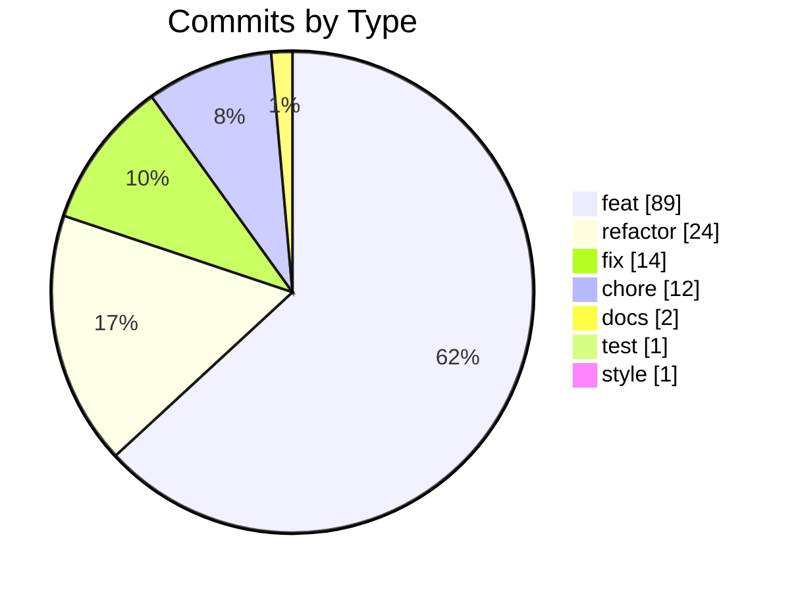
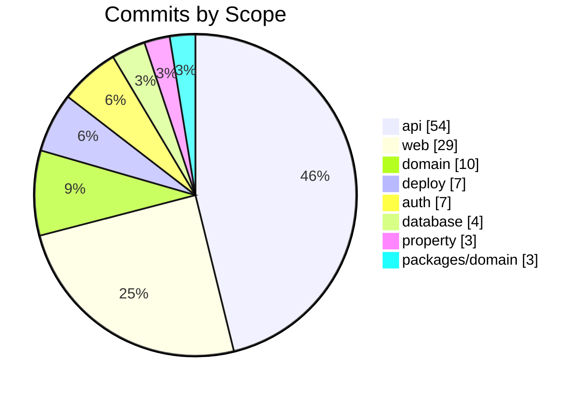
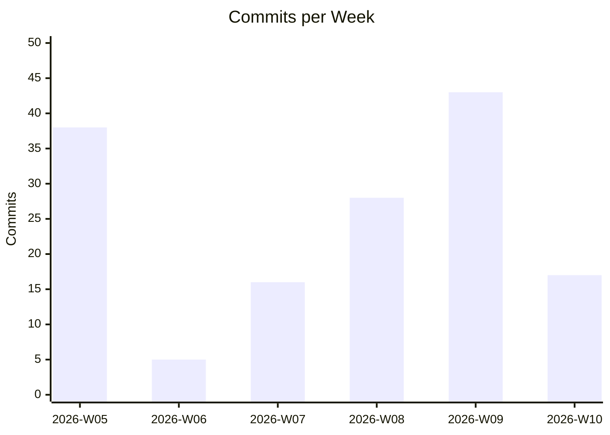

# Project Statistics

> Auto-generated from git history. Last updated: 2026-03-05 17:11

**Total commits (no merges):** 146

---

## Commits by Type

## Commits by Scope

## Activity by Week

## Most Changed Files

| Changes | File |
|:-------:|------|
| 18      | `apps/api/src/app.module.ts` |
| 13      | `apps/api/src/database/database.service.ts` |
| 12      | `packages/database/prisma/schema.prisma` |
| 12      | `apps/api/src/space/space.module.ts` |
| 11      | `apps/api/src/space/space.controller.ts` |
| 11      | `apps/api/src/property/property.service.ts` |
| 10      | `apps/api/src/user/user.controller.ts` |
| 10      | `apps/api/src/space/space.service.ts` |
| 10      | `apps/api/src/auth/register-user.usecase.ts` |
| 10      | `apps/api/src/auth/auth.controller.ts` |

## Most Active Days

| Date | Commits |
|------|---------|
| 2026-02-28 | 33 |
| 2026-01-31 | 18 |
| 2026-03-02 | 17 |
| 2026-02-21 | 12 |
| 2026-02-14 | 11 |
| 2026-02-16 | 9 |
| 2026-01-30 | 9 |

